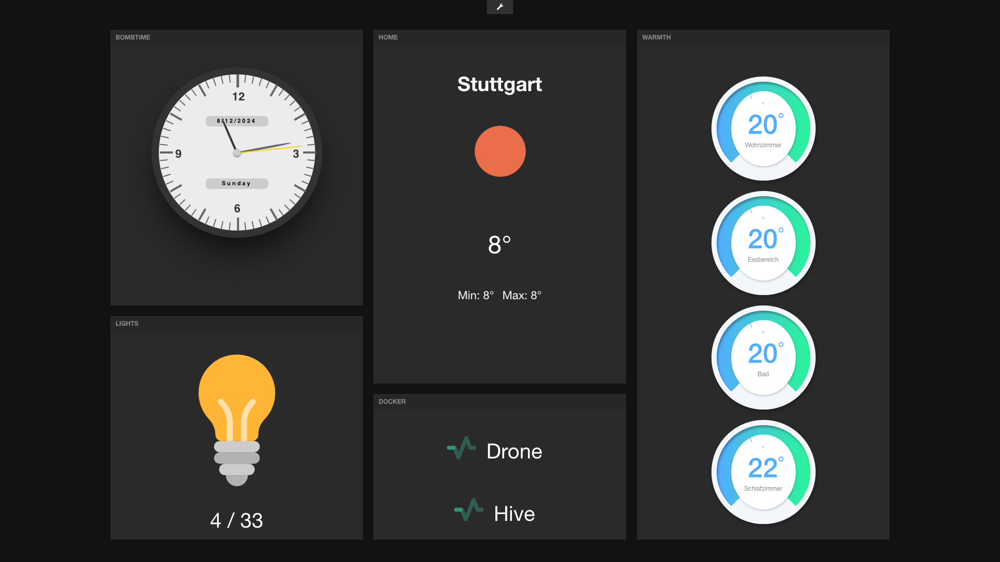

# freeboard

[](https://github.com/CameronBrooks11/freeboard/actions/workflows/ci.yml)
[](https://github.com/CameronBrooks11/freeboard/actions/workflows/e2e-smoke.yml)
[](https://github.com/CameronBrooks11/freeboard/actions/workflows/build-docker-images.yml)

freeboard is a modern fork of [Jim Heising's Freeboard](https://github.com/Freeboard/freeboard) focused on secure, production-grade dashboard delivery for IoT and operations use cases.

It adds:

- persistent dashboard storage in PostgreSQL
- GraphQL API backend
- Vue 3 frontend
- gateway-backed HTTP datasources with egress controls
- gateway-backed realtime datasources (SSE, WebSocket, MQTT)
- role-aware auth, sharing, and visibility model
- built-in widget set (Base, Text, Indicator, Gauge, Pointer, Picture, HTML, Sparkline, Table, Bar Chart, Status List, Map)
- Docker Compose runtime and Raspberry Pi kiosk automation


> Live demo: [Try Out](https://CameronBrooks11.github.io/freeboard)



## Documentation

- Manual home: `docs/manual/index.md`
- Installation: `docs/manual/installation.md`
- Usage workflow: `docs/manual/usage.md`
- Datasource reference: `docs/manual/datasource-reference.md`
- Gateway contract: `docs/manual/gateway.md`
- Service accounts runbook: `docs/manual/service-accounts.md`
- Runtime metrics guide: `docs/manual/runtime-metrics.md`
- Deployment profiles: `docs/manual/deployment-profiles.md`
- Kiosk + Ansible operations: `docs/manual/ansible.md`
- Legacy datastore architecture (archival): `docs/manual/legacy-datastore-architecture.md`
- Secrets runbook: `docs/manual/secrets-operations.md`
- Package docs:
  - API: `packages/api/README.md`
  - Gateway: `packages/gateway/README.md`
  - Shared: `packages/shared/README.md`
  - UI: `packages/ui/README.md`

## Requirements

- Node.js `24.13.1` to `<25` (see `.nvmrc`)
- npm `11.10.0` to `<12`
- Docker Engine `>=20.10`
- Docker Compose v2 (`docker compose`)
- Python `3.8+` and Ansible (only for kiosk automation)

## Quick Start (Local Development)

```bash
git clone https://github.com/CameronBrooks11/freeboard.git
cd freeboard
nvm use || nvm install
npm install
cp .env.dev .env
npm run dev
```

Open:

- UI: `http://127.0.0.1:5173`
- API: `http://127.0.0.1:4001/graphql`
- Gateway: `http://127.0.0.1:8001`

### First login bootstrap

- Set `CREATE_ADMIN=true` in `.env` for first bootstrap only.
- Log in using `ADMIN_EMAIL` and `ADMIN_PASSWORD`.
- Then set `CREATE_ADMIN=false`.
- Password policy: 12+ chars, uppercase, lowercase, number, symbol.

## Environment Files

- `.env.dev`: minimal local development configuration (copy to `.env` to start quickly)
- `.env.example`: full variable reference and defaults

API env precedence:

1. process environment (shell/CI)
2. `packages/api/.env` (optional local override)
3. repo root `.env`
4. code defaults

## Runtime Modes

### Local dev runtime

`npm run dev` behavior:

- starts Postgres via `docker-compose.postgres.yml` and waits for healthy status
- applies API schema changes (`npm run db:schema:apply`)
- starts UI/API/Gateway
- on Ctrl+C, stops UI/API/Gateway and leaves Postgres running

Helpful Postgres commands:

```bash
npm run dev:postgres:up
npm run dev:postgres:status
npm run dev:postgres:logs
npm run dev:postgres:down
npm run dev:postgres:reset
```

### Containerized runtime (Compose)

```bash
docker compose -f docker-compose.yml -f docker-compose.postgres.yml up -d
```

Minimum required `.env` values before shared/staging/production use:

- `JWT_SECRET`
- `JWT_GATEWAY_SECRET`
- `GATEWAY_SERVICE_TOKEN`
- `CREDENTIAL_ENCRYPTION_KEY`
- `FREEBOARD_POSTGRES_URL`
- `EGRESS_ALLOWED_HOSTS`
- `POSTGRES_USER`
- `POSTGRES_PASSWORD`
- `POSTGRES_DB`

Optional image pinning:

- `FREEBOARD_UI_IMAGE_TAG` (default `latest`)
- `FREEBOARD_API_IMAGE_TAG` (default `latest`)
- `FREEBOARD_GATEWAY_IMAGE_TAG` (default `latest`)

Published tags:

- `latest`
- `v<workspace-version>`
- `sha-<short-commit>`
- `latest-armv7` (legacy 32-bit Pi track)
- `v<workspace-version>-armv7` (legacy 32-bit Pi track)
- `sha-<short-commit>-armv7` (legacy 32-bit Pi track)

Architecture strategy:

- Mainline tags (`latest`, `v*`, `sha-*`) publish `linux/amd64` and `linux/arm64` using Node 24.
- Legacy `-armv7` tags publish `linux/arm/v7` using Node 22 for 32-bit Raspberry Pi compatibility.
- `linux/arm/v6` is intentionally unsupported.

References for this split:

- Docker Raspberry Pi OS (32-bit) guidance and deprecation notes:
  - https://docs.docker.com/engine/install/raspberry-pi-os/
  - https://docs.docker.com/engine/release-notes/29/
- Node official image upstream:
  - https://github.com/nodejs/docker-node
- Node official tags on Docker Hub:
  - https://hub.docker.com/_/node

Use `docs/manual/secrets-operations.md` for setup, rotation, and incident workflow.

## Quality Checks

```bash
npm run format:check
npm run lint
npm run check:ui:store-boundaries
npm run test
npm run build:verify
```

Format in place:

```bash
npm run format
```

## Realtime Demo Fixtures

```bash
npm run demo:realtime:up
npm run demo:realtime:smoke
npm run demo:realtime:down
```

One-shot integration run:

```bash
npm run test:realtime:integration
```

## CI Workflows

- `CI` (`.github/workflows/ci.yml`)
  - pull requests to `main`, merge queue, manual dispatch
  - docs-only changes skip heavy jobs
  - includes path-gated `test-e2e-smoke` in the required workflow for API, UI, gateway, `packages/shared`, and e2e changes
  - stable required check: `Required CI`
- `E2E smoke` (`.github/workflows/e2e-smoke.yml`)
  - manual dispatch only
  - ad-hoc browser smoke rerun with Playwright artifacts
- `Build & publish docker images` (`.github/workflows/build-docker-images.yml`)
  - push to `main`, manual dispatch
  - package-aware matrix build skips unchanged images
  - includes `latest`, `v*`, and `sha-*` tags
- `Deploy to GitHub Pages` (`.github/workflows/build-pages.yml`)
  - push to `main` for docs/demo-relevant paths, manual dispatch
- `Ansible quality` (`.github/workflows/ansible-quality.yml`)
  - validates kiosk automation changes via `ansible-lint` and syntax checks
- `Repository Metrics` (`.github/workflows/metrics.yml`)
  - runs on pushes/manual dispatch and publishes metrics artifacts
- `Dependency security audit` (`.github/workflows/dependency-security.yml`)
  - scheduled weekly and manual dispatch
  - fails on production dependency vulnerabilities at high/critical severity

## Raspberry Pi Kiosk Automation

Create inventory:

```bash
cp ansible/inventory.ini.example ansible/inventory.ini
```

Pattern A (recommended): control node applies to remote kiosk hosts.

```bash
ANSIBLE_CONFIG=ansible/ansible.cfg ansible-playbook -i ansible/inventory.ini ansible/playbook.yml \
  -e "kiosk_profile=player_only kiosk_player_url=http://<freeboard-host>:8080/s/<share-token>" --check --diff
ANSIBLE_CONFIG=ansible/ansible.cfg ansible-playbook -i ansible/inventory.ini ansible/playbook.yml \
  -e "kiosk_profile=player_only kiosk_player_url=http://<freeboard-host>:8080/s/<share-token>"
```

Pattern B: local self-provision on a single Pi.

```bash
python -m venv .venv
.venv/bin/pip install -r requirements.txt
ANSIBLE_CONFIG=ansible/ansible.cfg .venv/bin/ansible-playbook -i localhost, -c local ansible/playbook.yml \
  -e "freeboard_target_group=all kiosk_profile=player_only kiosk_player_url=http://127.0.0.1:8080/s/<share-token>" --check --diff
ANSIBLE_CONFIG=ansible/ansible.cfg .venv/bin/ansible-playbook -i localhost, -c local ansible/playbook.yml \
  -e "freeboard_target_group=all kiosk_profile=player_only kiosk_player_url=http://127.0.0.1:8080/s/<share-token>"
```

Rollback:

```bash
ANSIBLE_CONFIG=ansible/ansible.cfg ansible-playbook -i ansible/inventory.ini ansible/rollback.yml
```

Legacy datastore notes (archival only):

- `docs/manual/legacy-datastore-architecture.md`

## Acknowledgement

Continues the work of [artificialhoney/freeboard](https://github.com/artificialhoney/freeboard), an archived prototype branch derived from the once-popular but long-unmaintained [Freeboard/freeboard](https://github.com/Freeboard/freeboard).

## Bug Reports, Support, and Security

- Bug reports: use the GitHub **Bug Report** issue form.
- Widget proposals: use the **Widget Proposal** issue form.
- Support/questions: use GitHub Discussions.
- Security vulnerabilities: report privately through the Security advisory flow described in `SECURITY.md`.

## Contributing

See [CONTRIBUTING.md](CONTRIBUTING.md) for PR expectations, widget proposal flow, and quality/security checklists.
See [docs/manual/translations.md](docs/manual/translations.md) for UI/docs translation contribution rules.
See [CONTRIBUTING_OPPORTUNITIES.md](CONTRIBUTING_OPPORTUNITIES.md) for active community contribution work (including translation review requests).

## Copyright

Copyright © 2013 Jim Heising ([github.com/jheising](https://github.com/jheising))

Copyright © 2013 Bug Labs, Inc. ([buglabs.net](https://buglabs.net))

Copyright © 2024 Sebastian Krüger ([sk.honeymachine.io](https://sk.honeymachine.io))

Copyright © 2026 Cameron K. Brooks ([github.com/CameronBrooks11](https://github.com/CameronBrooks11))

Licensed under the [MIT License](/LICENSE)
